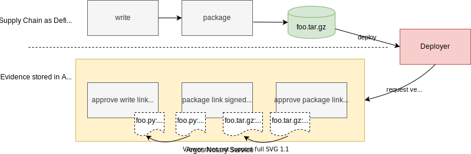

## Introduction

A complete definition can be found in the [Specification](../50_reference/specification)

## System overview

### Terminology

* **Software Supply Chain** (or SSC): the series of actions performed to create a software product. These steps usually begin with users committing to a version control system and end with the software product's installation on a client's system.
* **Layout**: a signed file that dictates the series of steps that need to be carried out in the SCC to create a final product. The layout includes ordered segments and steps, requirements for the steps, and the list of actors (or functionaries) in charge of carrying out every step. The steps within the supply chain are laid out by a project owner.
* **Layout Segment**: a natural clustering of steps within a component of the Supply Chain.
* **Layout Step**: a single action in a Layout Segment, which is performed by a functionary.
* **Link**: Information gathered while performing a supply chain step, signed by the functionary that performed the step. This includes information such as materials and products.
* **Materials**: the elements used (e.g., files) to perform a step in the supply chain. Files generated by one step (e.g., .o files) can be materials for a step further down the chain (e.g., linking). Materials are recorded as part of the link data
* **Products**: the result of carrying out a step. Products are usually persistent (e.g,. files), and are often meant to be used as materials on subsequent steps. Products are recorded as part of link data.
* **Artifact**: a material or a product, as described above.
* **End Products**: the files which are delivered bij the SSC and are required for the software's installation on the client's system.
* **Verification**: the process by which data and metadata included in the final product is used to ensure its correctness. Verification is performed by the client by requesting a verification on the Argos Notary Service.
* **Project Owner**: the authoritative figure within a project. The project owner will dictate which steps are to be carried out in the supply chain, and who is authorized to carry out each step (i.e., define the layout).
* **Functionary**: an actor that will perform an action within the supply chain. For example, the actor in charge of compiling a project's source code is a functionary.
 
### Involved actors

In the context of Argos Notary, a actor has duties and has to perform a set of actions.

In the description of the actors that follows, it is important to remember that the framework has been designed to allow a large amount of flexibility for many different use cases. Given that every project uses a very specific set of tools and practices, this is a necessary requirement for Argos Notary.

There are three different kind of actors in the framework:

* **Project Owner**: defines the layout of a software supply chain
* **Functionary**: performs a step in the supply chain and provides a piece of link metadata as a record that such a step was carried out.
* **Client**: Performs verification on a set of end products by requesting a validation of the set on the Argos Notary Service.

Layouts and links are signed with the private RSA key of the actor.

### Components

Argos Notary has three types of components

* **Argos Notary Service**: An integrated service to store and manage all Argos Notary objects
* **Artifact Collectors**: Services to collect Artifacts in the same as domain as the Artifact store, e.g. Git, Maven...
* **Deployment Verifiers**: Extensions on Deployment Mechanisms to validate end products to deploy.  

### Workflow example

To exemplify the working of the system, we will describe a simple scenario.

Consider a project owner, Alice, and her five functionaries, Diana, Bob, Carl, Build and Deploy. Alice wants Diana to write a Python script (foo.py). Then, Alice wants Build to package the script into a tarball (foo.tar.gz). This tarball will be sent to the client, Deploy, as part of the end product. Deploy’s target file is foo.tar.gz.

Alice will create a layout object that will be used by the Argos Notary Service during the verification request by Build to make sure of the following:

* That Bob and Carl approved the script which was written by Diana
* That the script written by Diana was input for the packaging of the tarball done by Build.
* That the tarball is approved by Alice.

In order for the Argos Notary Servive to do this, it will need four link objects and the layout: first, Alice’s layout, describing the requirements listed above. Then, 2 link objects signed by Bob and Carl which correspond to the approval of Diana’s action of writing a script, and a link object signed by Build for the step of packaging the script. Finally, there should be a link object signed by Alice to approve the target file (foo.tar.gz) which is part of the end products.

When the Argos Notary Service verifies the end product on behalf of Deploy, it will perform the following checks:

1. The layout file exists and is signed with a trusted key (in this case, Alice's).
2. All end product artifacts match with the expected end products in the layout. 
2. Every step in the layout has at least as much as needed corresponding link objects signed by the intended functionaries, as described in the layout.
3. All the materials and products listed in the link object match, as specified by the layout. This will be used to prevent packages from being altered without a record (missing artifacts in the link object), or tampered with while in transit. In this case, the products reported by Bob should match the materials reported by Build and so on.

If all of these verifications pass, the Argos Notary Service returns the valid message on the request.

1. the workflow for this example

